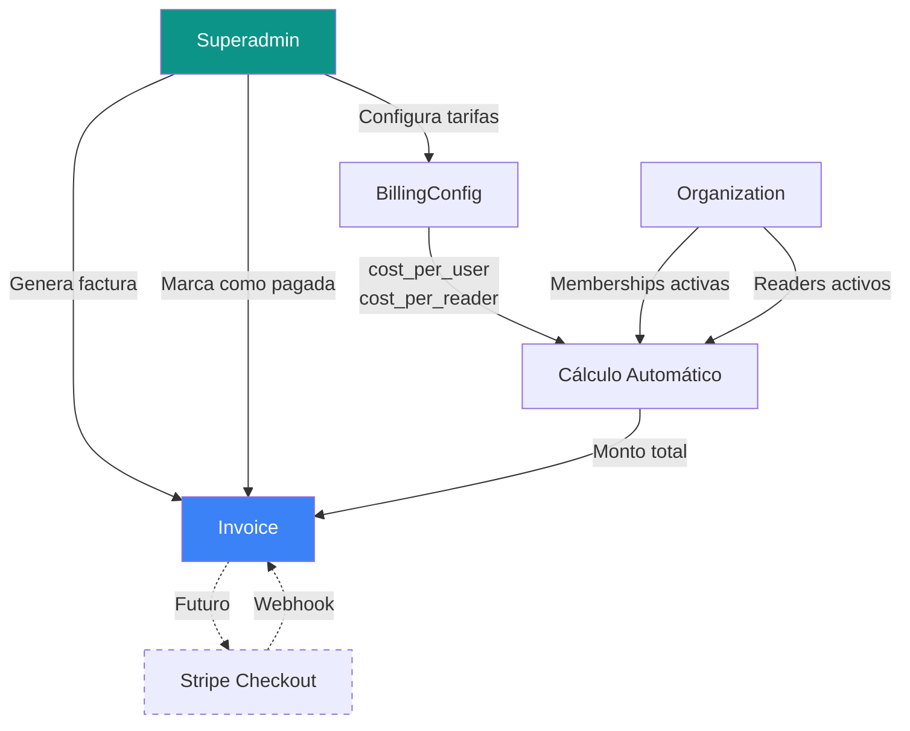
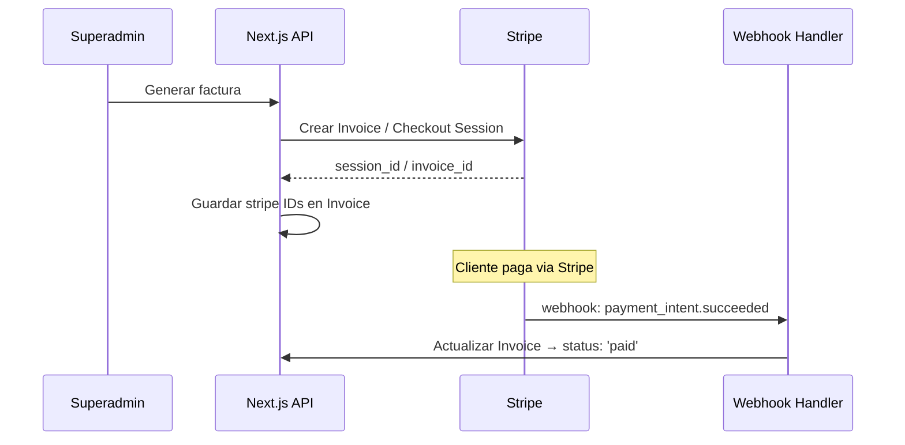

# 💰 Plan de Implementación — Pagos Pendientes por Organización

## Resumen Ejecutivo

Módulo de **gestión manual de facturación** para el **superadmin** de Secure-Pass-NFC. Permite calcular el costo mensual de cada organización basándose en:
- **Usuarios activos** (miembros con `status: 'active'` vinculados)
- **Máquinas/Lectores instalados** (readers con `status: 'active'`)

Los costos unitarios son **variables** y definidos globalmente por el superadmin. Los pagos **no se procesan por la plataforma** en esta fase; solo se registra manualmente si fueron realizados.

> [!IMPORTANT]
> El diseño contempla desde el inicio la futura integración con **Stripe** (checkout sessions, webhooks de confirmación, suscripciones recurrentes) sin requerir cambios estructurales en los modelos.

---

## Arquitectura Propuesta



---

## Fase 1 — Modelos de Datos

### 1.1 `BillingConfig` (Configuración global de tarifas)

> Modelo singleton — solo un documento en la colección.

```typescript
// models/BillingConfig.ts

interface IBillingConfig extends Document {
  cost_per_active_user: number;   // Costo unitario por usuario activo (USD o moneda local)
  cost_per_active_reader: number; // Costo unitario por lector activo
  currency: string;               // "USD" | "VES" | "EUR"
  billing_cycle: 'monthly' | 'quarterly' | 'yearly'; // Ciclo de facturación
  notes?: string;                 // Notas del superadmin
  // ── Preparación Stripe ──
  stripe_price_user_id?: string;  // Stripe Price ID (futuro)
  stripe_price_reader_id?: string;
}

const BillingConfigSchema = new Schema({
  cost_per_active_user:  { type: Number, required: true, default: 1.00 },
  cost_per_active_reader: { type: Number, required: true, default: 5.00 },
  currency:              { type: String, default: 'USD' },
  billing_cycle:         { type: String, enum: ['monthly','quarterly','yearly'], default: 'monthly' },
  notes:                 { type: String },
  stripe_price_user_id:  { type: String },
  stripe_price_reader_id:{ type: String },
}, { timestamps: true });
```

| Campo | Descripción |
|---|---|
| `cost_per_active_user` | Precio por cada usuario con `status: active` y membership activa |
| `cost_per_active_reader` | Precio por cada Reader con `status: active` |
| `currency` | Moneda (preparado para multi-moneda) |
| `billing_cycle` | Define el periodo de facturación |
| `stripe_price_*` | Campos opcionales para mapear a Stripe Prices en el futuro |

### 1.2 `Invoice` (Factura por organización)

```typescript
// models/Invoice.ts

interface IInvoice extends Document {
  organization_id: mongoose.Types.ObjectId;
  // ── Snapshot del cálculo ──
  period_start: Date;
  period_end: Date;
  active_users_count: number;
  active_readers_count: number;
  cost_per_user_at_billing: number;   // Snapshot de la tarifa al momento
  cost_per_reader_at_billing: number; // Snapshot de la tarifa al momento
  subtotal_users: number;             // active_users_count × cost_per_user
  subtotal_readers: number;           // active_readers_count × cost_per_reader
  total_amount: number;               // Suma de subtotales
  currency: string;
  // ── Estado del pago ──
  status: 'pending' | 'paid' | 'overdue' | 'cancelled';
  payment_method?: 'manual' | 'stripe' | 'bank_transfer';
  paid_at?: Date;
  paid_by?: string;                   // Nombre/referencia de quién pagó
  payment_reference?: string;         // Nro de transferencia, etc.
  notes?: string;
  // ── Preparación Stripe ──
  stripe_invoice_id?: string;
  stripe_payment_intent_id?: string;
  stripe_checkout_session_id?: string;
}

const InvoiceSchema = new Schema({
  organization_id:          { type: Schema.Types.ObjectId, ref: 'Organization', required: true },
  period_start:             { type: Date, required: true },
  period_end:               { type: Date, required: true },
  active_users_count:       { type: Number, required: true },
  active_readers_count:     { type: Number, required: true },
  cost_per_user_at_billing: { type: Number, required: true },
  cost_per_reader_at_billing:{ type: Number, required: true },
  subtotal_users:           { type: Number, required: true },
  subtotal_readers:         { type: Number, required: true },
  total_amount:             { type: Number, required: true },
  currency:                 { type: String, default: 'USD' },
  status:                   { type: String, enum: ['pending','paid','overdue','cancelled'], default: 'pending' },
  payment_method:           { type: String, enum: ['manual','stripe','bank_transfer'] },
  paid_at:                  { type: Date },
  paid_by:                  { type: String },
  payment_reference:        { type: String },
  notes:                    { type: String },
  stripe_invoice_id:        { type: String },
  stripe_payment_intent_id: { type: String },
  stripe_checkout_session_id:{ type: String },
}, { timestamps: true });

InvoiceSchema.index({ organization_id: 1, period_start: 1 });
InvoiceSchema.index({ status: 1 });
```

> [!TIP]
> Los campos `cost_per_user_at_billing` y `cost_per_reader_at_billing` son **snapshots**. Esto asegura que si el superadmin cambia las tarifas, las facturas históricas conservan el valor al momento de emisión.

---

## Fase 2 — API Routes

### 2.1 Configuración de Tarifas

| Método | Ruta | Descripción |
|---|---|---|
| `GET` | `/api/billing/config` | Obtener configuración actual de tarifas |
| `PUT` | `/api/billing/config` | Actualizar tarifas (solo superadmin) |

### 2.2 Facturas (Invoices)

| Método | Ruta | Descripción |
|---|---|---|
| `GET` | `/api/billing/invoices` | Listar todas las facturas (con filtros por org, status, periodo) |
| `GET` | `/api/billing/invoices/[id]` | Detalle de una factura |
| `POST` | `/api/billing/invoices/generate` | Generar factura para una o todas las organizaciones |
| `PUT` | `/api/billing/invoices/[id]` | Actualizar estado (marcar como pagada, cancelar) |
| `DELETE` | `/api/billing/invoices/[id]` | Eliminar factura (solo si está cancelada) |

### 2.3 Cálculo / Preview

| Método | Ruta | Descripción |
|---|---|---|
| `GET` | `/api/billing/preview/[orgId]` | Calcular el costo estimado de una org sin generar factura |
| `GET` | `/api/billing/summary` | Resumen general: total pendiente, pagado, por organización |

### Lógica de cálculo (pseudocódigo)

```typescript
async function calculateOrgBilling(orgId: string, config: IBillingConfig) {
  // Contar usuarios activos con membership en esta organización
  const activeUsersCount = await Membership.countDocuments({
    organization_id: orgId,
  });
  // NOTA: Se podría refinar con un lookup a User para filtrar solo status: 'active'

  // Contar readers activos de esta organización
  const activeReadersCount = await Reader.countDocuments({
    organization_id: orgId,
    status: 'active',
  });

  const subtotalUsers   = activeUsersCount * config.cost_per_active_user;
  const subtotalReaders = activeReadersCount * config.cost_per_active_reader;
  const total           = subtotalUsers + subtotalReaders;

  return {
    activeUsersCount,
    activeReadersCount,
    subtotalUsers,
    subtotalReaders,
    total,
    currency: config.currency,
  };
}
```

> [!NOTE]
> El conteo de usuarios activos puede refinarse haciendo un `aggregate` con `$lookup` a la colección `Users` para filtrar solo aquellos con `status: 'active'`. Esto depende de si quieres cobrar por todos los miembros o solo los que completaron registro.

---

## Fase 3 — Interfaz de Superadmin

### 3.1 Nueva sección en el sidebar: **"Facturación"**

Agregar al `navItems` del [layout.tsx](file:///c:/Users/USUARIO/Desktop/proyectos/Id_CheckCard/web/app/admin/layout.tsx):

```typescript
{ href: "/admin/billing", label: "Facturación", icon: Receipt },
```

### 3.2 Página `/admin/billing` — Vista principal

```
┌──────────────────────────────────────────────────────────────┐
│  📊 Resumen de Facturación                                   │
│  ┌────────────┐  ┌────────────┐  ┌────────────┐             │
│  │ Total      │  │ Pendiente  │  │ Cobrado    │             │
│  │ $X,XXX.XX  │  │ $X,XXX.XX  │  │ $X,XXX.XX  │             │
│  └────────────┘  └────────────┘  └────────────┘             │
│                                                              │
│  ⚙️ Configurar Tarifas    📝 Generar Facturas del Periodo    │
├──────────────────────────────────────────────────────────────┤
│  📋 Facturas Recientes                          [Filtros ▼]  │
│  ┌───────────┬──────────┬────────┬──────────┬────────┬────┐ │
│  │ Org       │ Periodo  │ Usu.   │ Lect.    │ Total  │ Est│ │
│  ├───────────┼──────────┼────────┼──────────┼────────┼────┤ │
│  │ Empresa A │ Mar 2026 │ 45     │ 3        │ $60.00 │ 🟡 │ │
│  │ Escuela B │ Mar 2026 │ 120    │ 5        │ $145.0 │ 🟢 │ │
│  │ Club C    │ Mar 2026 │ 30     │ 2        │ $40.00 │ 🔴 │ │
│  └───────────┴──────────┴────────┴──────────┴────────┴────┘ │
└──────────────────────────────────────────────────────────────┘
```

### 3.3 Modal: Configurar Tarifas

- Input: **Costo por usuario activo**
- Input: **Costo por lector activo**
- Select: **Moneda** (USD, VES, EUR)
- Select: **Ciclo de facturación** (Mensual, Trimestral, Anual)
- Textarea: **Notas**
- Botón: Guardar

### 3.4 Modal: Generar Facturas

- Select: **Organización** (o "Todas")
- DatePicker: **Periodo** (mes/año)
- Preview en tiempo real: muestra el desglose antes de confirmar
- Botón: "Generar Factura(s)"

### 3.5 Modal: Registrar Pago

- Select: **Método de pago** (Transferencia, Efectivo, Otro)
- Input: **Referencia de pago**
- Input: **Pagado por** (nombre/referencia)
- Textarea: **Notas**
- Fecha automática (`paid_at = now`)
- Botón: "Confirmar Pago"

---

## Fase 4 — Preparación para Stripe (Futuro)

> [!WARNING]
> Esta fase NO se implementa ahora. Los campos y la arquitectura se dejan listos.

### Modelo de integración previsto:



### Pasos futuros cuando se active Stripe:

1. `npm install stripe`
2. Crear `/api/billing/stripe/checkout` — genera Stripe Checkout Session
3. Crear `/api/billing/stripe/webhook` — recibe confirmaciones
4. Agregar `STRIPE_SECRET_KEY` y `STRIPE_WEBHOOK_SECRET` al `.env`
5. Mapear `BillingConfig.stripe_price_*_id` a los Products/Prices de Stripe
6. Cambiar `payment_method` a `'stripe'` automáticamente en facturas pagadas por Stripe
7. Agregar botón "Pagar con Stripe" en el panel de la organización

---

## Fase 5 — Estructura de Archivos

```
web/
├── models/
│   ├── BillingConfig.ts          ← NUEVO
│   └── Invoice.ts                ← NUEVO
├── app/
│   ├── api/
│   │   └── billing/
│   │       ├── config/
│   │       │   └── route.ts      ← GET + PUT tarifas
│   │       ├── invoices/
│   │       │   ├── route.ts      ← GET (listar) + POST (generar masivo)
│   │       │   ├── generate/
│   │       │   │   └── route.ts  ← POST (generar para una/todas las orgs)
│   │       │   ├── summary/
│   │       │   │   └── route.ts  ← GET resumen financiero
│   │       │   └── [id]/
│   │       │       └── route.ts  ← GET, PUT, DELETE factura individual
│   │       └── preview/
│   │           └── [orgId]/
│   │               └── route.ts  ← GET cálculo estimado
│   └── admin/
│       └── billing/
│           └── page.tsx          ← Panel de facturación
```

---

## Estimación de Esfuerzo

| Fase | Descripción | Estimación |
|---|---|---|
| 1 | Modelos de datos (`BillingConfig`, `Invoice`) | ~30 min |
| 2 | API Routes (config, invoices, preview, summary) | ~2-3 horas |
| 3 | Interfaz de superadmin (página + modales) | ~3-4 horas |
| 4 | Preparación Stripe (solo campos, sin lógica) | Ya incluida en Fase 1 |
| 5 | Testing y ajustes | ~1 hora |
| **Total** | | **~6-8 horas** |

---

## Decisiones de Diseño Clave

1. **Snapshots en facturas:** Las tarifas se guardan en cada factura individual, no se recalculan. Si las tarifas cambian, las facturas anteriores no se ven afectadas.

2. **BillingConfig como singleton:** Solo un documento global. Si en el futuro se necesitan tarifas diferenciadas por tipo de organización, se puede migrar a un esquema por-organización.

3. **Conteo de usuarios:** Se basa en `Membership.countDocuments()` con posible lookup a `User.status === 'active'`. Esto es configurable.

4. **Sin procesamiento automático de pagos:** Todo es manual. El superadmin genera, revisa y marca como pagado. La plataforma nunca toca dinero.

5. **Escalabilidad a Stripe:** Todos los campos de Stripe (`stripe_invoice_id`, `stripe_checkout_session_id`, etc.) están presentes pero opcionales. La transición será aditiva, no destructiva.
